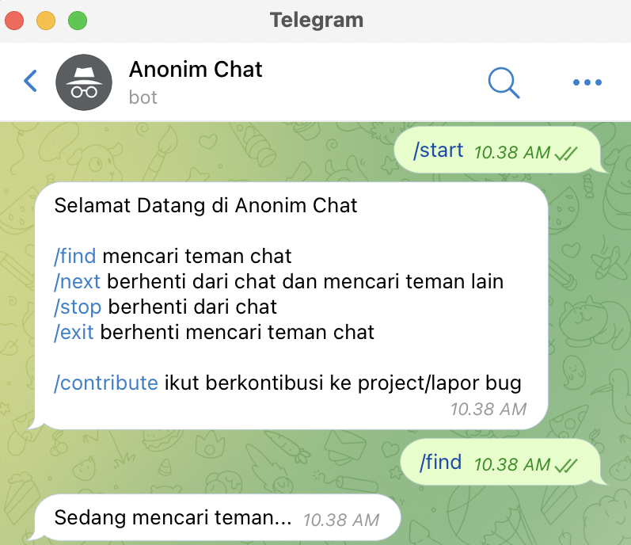

# anonim-chat
[](https://www.codefactor.io/repository/github/shiyinq/anonim-chat/overview/main)


[](https://github.com/Shiyinq/anonim-chat)


Chat with random stranger anonymously




## Requirements
- node js v14
- mongodb v5

## Setup
- ```git clone https://github.com/Shiyinq/anonim-chat.git```
- ```cd anonim-chat```
- ```npm install```
- rename ```.env.example``` to ```.env``` and edit ```.env``` with your own bot token and mongo uri
- ```npm run dev```
