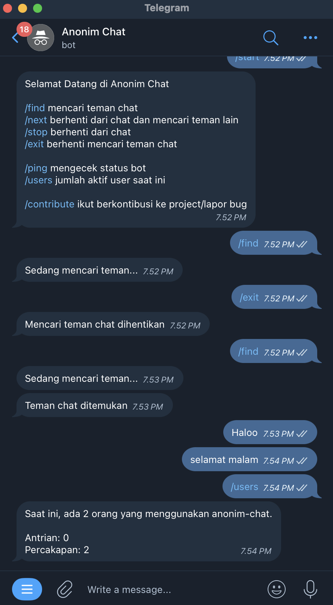

# anonim-chat
[](https://github.com/Shiyinq/anonim-chat)


|  |  |  |
|:---:|:---:|:---:|


Anonymously chat with a stranger.


## Table of Contents
- [anonim-chat](#anonim-chat)
  - [Table of Contents](#table-of-contents)
  - [Requirements](#requirements)
  - [Development](#development)
  - [Deployment](#deployment)

## Requirements
- Node JS v20.10.0
- NPM v10.2.3
- nodemon lates
- MongoDB v5

## Development
Clone and install dependencies.

**1. Clone this repository**
```
git clone https://github.com/Shiyinq/anonim-chat.git
```
**2. Navigate to the project directory**

```bash
cd anonim-chat
```
**3. Install dependencies**

```bash
npm install
```

**4. Create `.env` file**

```base
cp .env.example .env
```

**5. Fill the `BOT_TOKEN`**

you can get token from [@BotFather](https://t.me/botfather)

**6. Run the bot script**

```bash
npm run dev
```

## Deployment
Before you begin, ensure you have [Docker](https://docs.docker.com/engine/install/) installed.

**1. Clone the repository**
```bash
git clone https://github.com/Shiyinq/anonim-chat.git
cd anonim-chat
```

**2. Create environment files**
```bash
cp .env.example .env
```

Open `.env` file you have created and update the values.

**3. Build and run the Docker containers**
```bash
docker compose up --build -d
```
Wait a few minutes for the setup to complete, bot running on http://localhost:8080.